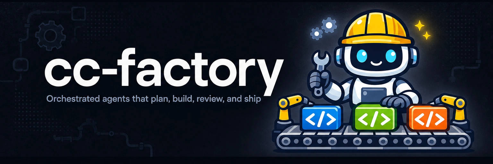

# 

**Your spec clocks in. A reviewed diff clocks out.** cc-factory is an assembly line of agents that designs, plans, builds in parallel, reviews, and argues against your change before it leaves the floor.

<a href="LICENSE"></a>

cc-factory is at the design stage. The pipeline described below is the design; nothing here installs or runs yet.

---

## Use cases

### Ship a feature from a one-line spec

Driving one Claude session through a feature means steering every step yourself. You prompt the plan, watch the edits, kick off the review, and nudge it along. The factory takes the spec and runs the whole line:

```text
/cc-factory:build "Add per-key rate limiting to the public API, 100 req/min"
```

The factory plans the change, dispatches a pool of workers to implement it, opens a review on the resulting diff, and surfaces objections for you to resolve before it merges. Your first touch is the finished diff.

### Build in parallel without steering every session

A single session has one thread of attention. It does one thing at a time and loses context across compactions. The factory fans the build across a worker pool and parks decisions in durable notes, so parallel work and long memory stop being your job.

### Catch agent-written bugs before they merge

Code an agent writes ships as fast as it's written, bugs and all. The line ends in two gates. A human review sits behind your Submit button, and an adversarial pushback pass argues against the diff before it lands.

## How the line is wired

cc-factory ships no engine of its own. Every stage is a tool that earns its keep standalone, and the factory is Claude Code plugin wiring. Skills, agents, commands, and hooks connect [cc-orchestrate](https://github.com/yasyf/cc-orchestrate) for the pipeline, [claude-pool](https://github.com/yasyf/cc-pool) for the parallel workers, [cc-review](https://github.com/yasyf/cc-review) for the human gate, [cc-notes](https://github.com/yasyf/cc-notes) for durable decisions, and [captain-hook](https://github.com/yasyf/captain-hook) for guardrails on every step. The adversarial pushback gate is the one stage without a standalone tool yet. [AGENTS.md](AGENTS.md) carries the conventions the line follows.

Licensed under [PolyForm Noncommercial 1.0.0](LICENSE).
